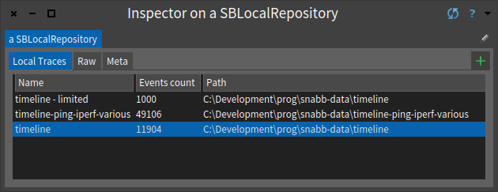

# SnabbStudio [](https://travis-ci.org/ObjectProfile/snabbstudio) [ ](https://bintray.com/peteruhnak/SnabbStudio/SnabbStudio/_latestVersion#files)

SnabbStudio: Graphical analysis toolkit for Snabb users and developers

list of local timelines:



overview of the breaths in the timeline


detailed view of events in a portion of the timeline


## Installation of SnabbStudio

Installing SnabbStudio is just a few steps:

1. Download the latest `.zip` build: [ ](https://bintray.com/peteruhnak/SnabbStudio/SnabbStudio/_latestVersion#files)
2. Download the Pharo virtual machine for your platform: http://pharo.org/download
3. Open the snabbstudio-XX-Moose-6.0.image by dragging it over the Pharo VM file.

## Example of uses


## Future work
- In the future, we will provide a one-click experience, that will be based on a bundle summarizing these steps.
- Statistical tooling

------

SnabbStudio can also be installed programmatically, however only experienced Pharo and Roassal programmers are recommended to use it:
```st
Metacello new
    baseline: 'SnabbStudio';
    repository: 'github://ObjectProfile/snabbstudio/repository';
    load
```
